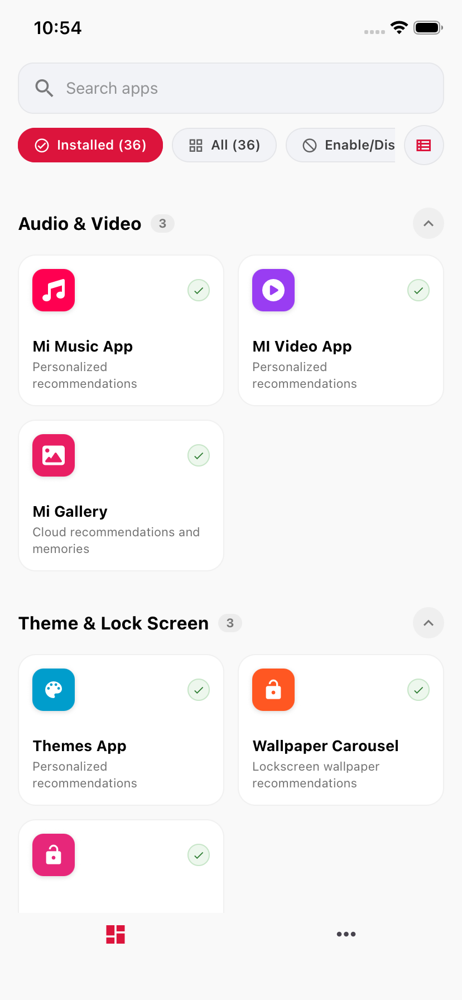
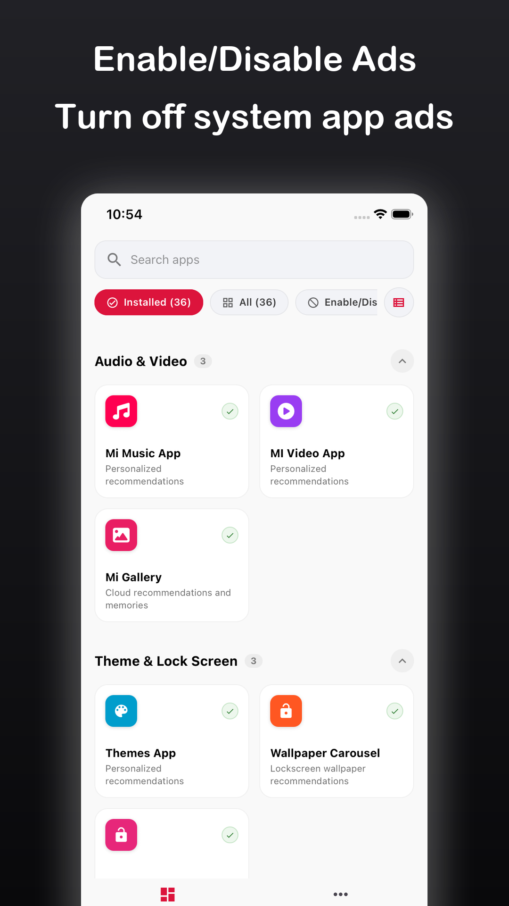
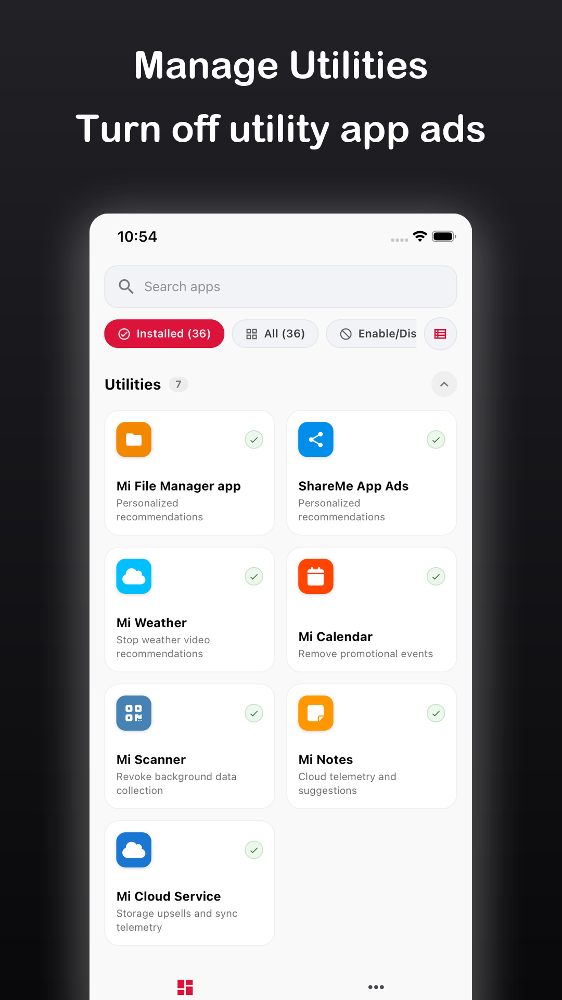
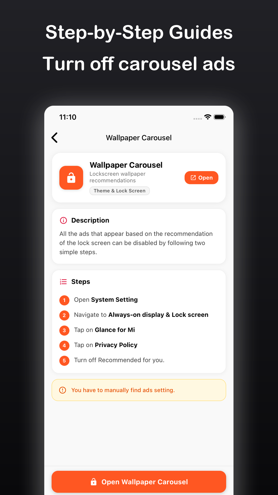
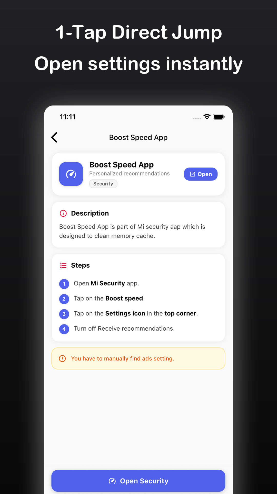
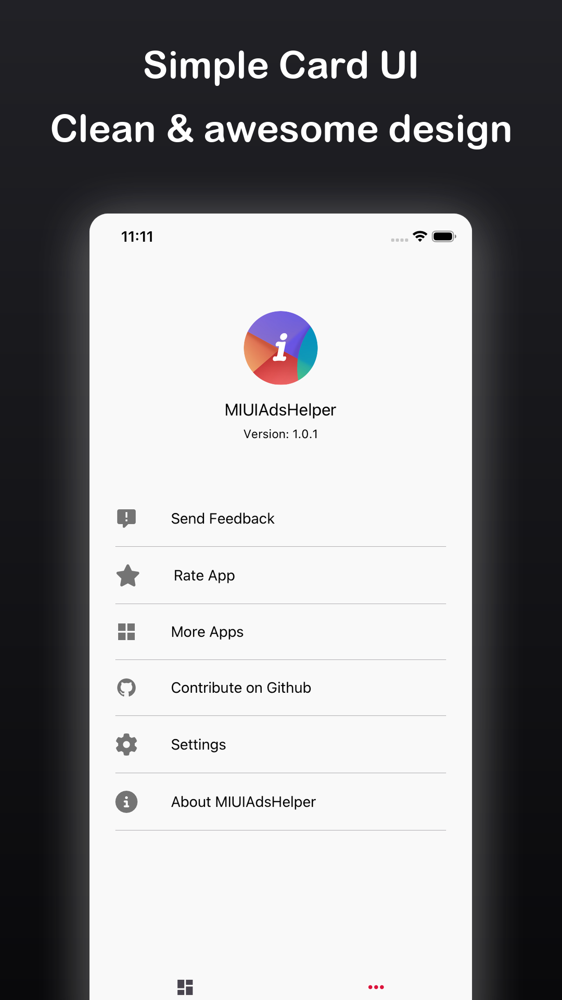
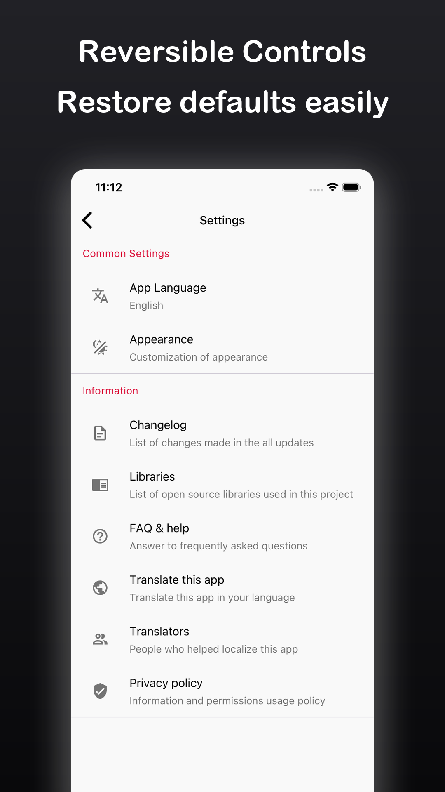
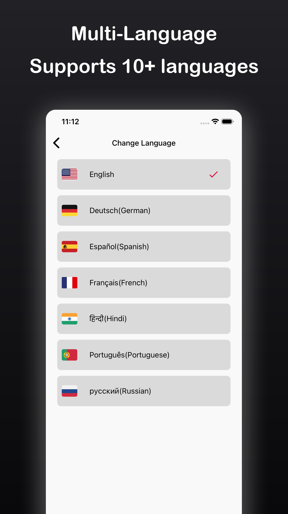
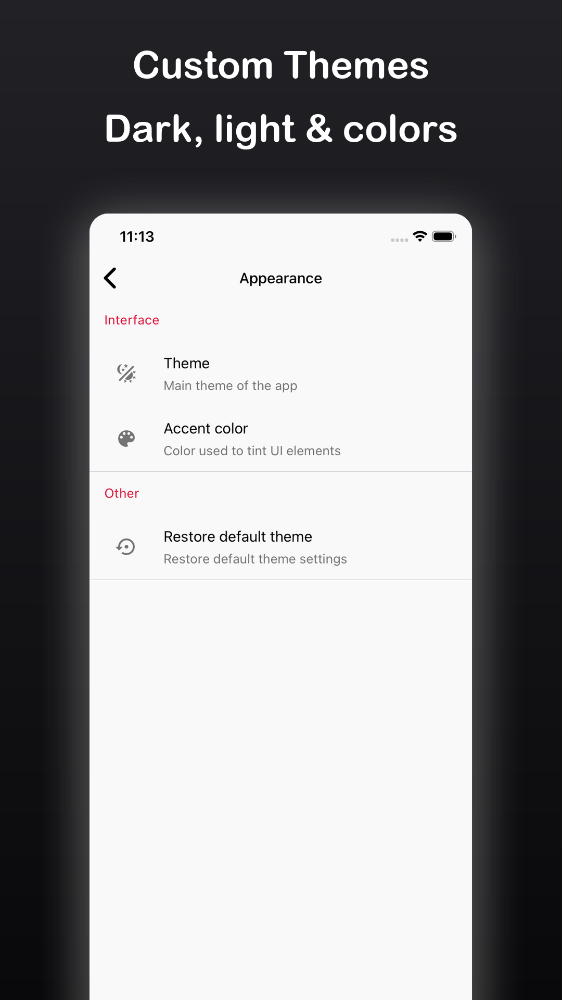

# StoreShot 🚀

[](https://www.python.org/)
[](LICENSE)
[](tests/)
[](https://flake8.pycqa.org/)

> **High-performance command-line & Python generator for Google Play Store and Apple App Store listing graphics.**

StoreShot converts raw mobile application screenshots into sleek, publication-ready app store marketing graphics. It automatically handles linear color gradients, antialiased rounded device framing, soft Gaussian drop shadows, customizable border rims, negative bleeding padding, and modern typography with intelligent two-line wrapping.

---

## Table of Contents

- [Features](#features)
- [Installation & Setup](#installation--setup)
- [Quickstart](#quickstart)
- [Real-World Project Showcase: MIUI Ads Helper](#real-world-project-showcase-miui-ads-helper)
- [Multi-Project Workspace Organization](#multi-project-workspace-organization)
- [JSON Configuration Reference](#json-configuration-reference)
- [CLI Reference](#cli-reference)
- [Typography & Font System](#typography--font-system)
- [Development & Testing](#development--testing)
- [License](#license)

---

## Features

- 🎨 **Rich Multi-Stop Gradients**: Smooth 8-bit per channel vertical and horizontal background gradients.
- 📱 **Rounded Device Framing & Rims**: Antialiased rounded corners with optional customizable outer stroke rims.
- 🌫️ **Realistic Drop Shadows**: High-fidelity Gaussian blurred drop shadows respecting the screenshot's silhouette.
- 🔤 **Advanced Typography Engine**:
  - Built-in font family presets (`rounded`, `sans`, `avenir`, `serif`, `mono`) and direct `.ttf`/`.otf` loading.
  - Independent top margin control (`text_margin_top` / `text_pad_top`).
  - Adjustable vertical line spacing (`line_spacing`) and line height multipliers (`line_height`).
  - Smart 2-line word wrapping with ellipsis truncation.
- 📐 **Bleeding & Negative Padding**: Full support for bottom screenshot bleed (`pad_bottom: -80`) for immersive phone mockups.
- 📂 **Multi-Project Workspaces**: Self-contained project folders (`projects/<app_name>/input/config.json`) with relative path resolution.
- ⚡ **High-Speed Multi-Threading**: Concurrent worker pool (`--workers 4`) for fast batch generation.
- 🧪 **Production Grade**: 100% test coverage across 34 automated unit and integration tests.

---

## Installation & Setup

### Prerequisites

- Python 3.10 or higher
- `pip` package manager

### 1. Clone & Set Up Virtual Environment

```bash
# Clone the repository
git clone https://github.com/gajjartejas/storeshot.git
cd storeshot

# Create a virtual environment
python3 -m venv .venv

# Activate virtual environment
# On macOS / Linux:
source .venv/bin/activate
# On Windows (PowerShell):
# .venv\Scripts\Activate.ps1
```

### 2. Install Dependencies & CLI

```bash
# Install core dependencies
pip install -r requirements.txt

# Install development & test dependencies (optional)
pip install -r requirements-dev.txt

# Install StoreShot CLI in editable mode
pip install -e .
```

Verify installation:
```bash
storeshot --help
```

---

## Quickstart

### Generate from JSON Configuration

```bash
storeshot --config projects/miui_ads_helper/input/config.json --overwrite
```

### Generate via Direct CLI Flags

```bash
storeshot \
  --input projects/miui_ads_helper/input \
  --output projects/miui_ads_helper/output \
  --bg-color-1 "#212126" \
  --bg-color-2 "#09090B" \
  --pad-top 410 \
  --pad-bottom -80 \
  --screenshot-border-radius 36 \
  --shadow-blur 44 \
  --text "Enable/Disable Ads\nTurn off system app ads" \
  --text-font rounded \
  --text-size 0.038 \
  --overwrite
```

---

## Real-World Project Showcase: MIUI Ads Helper

Here is a complete, real-world example configuring Google Play Store assets for the **MIUI Ads Helper** app.

### Project Layout

```
projects/miui_ads_helper/
├── input/
│   ├── config.json
│   ├── 1.png
│   ├── 2.png
│   ├── 3.png
│   ├── 4.png
│   ├── 5.png
│   ├── 6.png
│   ├── 7.png
│   └── 8.png
└── output/
    ├── 1.png
    ├── 2.png
    └── ...
```

### `config.json`

```json
{
  "out_width": 1080,
  "out_height": 1920,
  "bg_color_1": "#212126",
  "bg_color_2": "#09090B",
  "bg_orientation": "vertical",
  "pad_top": 410,
  "pad_bottom": -80,
  "pad_left": 75,
  "pad_right": 75,
  "screenshot_border_radius": 36,
  "screenshot_border_width": 2,
  "screenshot_border_color": "#FFFFFF25",
  "shadow_color": "#00000099",
  "shadow_blur": 44,
  "shadow_offset_x": 0,
  "shadow_offset_y": 18,
  "text_position": "top",
  "font": "rounded",
  "font_weight": "bold",
  "text_color": "#FFFFFF",
  "text_size": 0.038,
  "text_margin_top": 80,
  "text_padding": 35,
  "text_line_height": 1.18,
  "line_spacing": 42,
  "text_bg": "none",
  "output_dir": "../output",
  "format": "png",
  "screenshots": [
    {
      "file": "1.png",
      "text": "Enable/Disable Ads\nTurn off system app ads"
    },
    {
      "file": "2.png",
      "text": "Manage Utilities\nTurn off utility app ads"
    },
    {
      "file": "3.png",
      "text": "Step-by-Step Guides\nTurn off carousel ads"
    },
    {
      "file": "4.png",
      "text": "1-Tap Direct Jump\nOpen settings instantly"
    },
    {
      "file": "5.png",
      "text": "Simple Card UI\nClean & awesome design"
    },
    {
      "file": "6.png",
      "text": "Reversible Controls\nRestore defaults easily"
    },
    {
      "file": "7.png",
      "text": "Multi-Language\nSupports 10+ languages"
    },
    {
      "file": "8.png",
      "text": "Custom Themes\nDark, light & colors"
    }
  ]
}
```

### Running the Project

```bash
storeshot --config projects/miui_ads_helper/input/config.json --overwrite
```

### Visual Output Gallery

#### Before & After Comparison

| Raw Input Screenshot | Generated Store Graphic (1080×1920) |
|:---:|:---:|
|  |  |

#### Complete 8-Card Result Set

| 1. Ads Setting | 2. Utilities | 3. Carousel Guides | 4. Direct Jump |
|:---:|:---:|:---:|:---:|
|  |  |  |  |

| 5. Card UI | 6. Reversible | 7. Multi-Language | 8. Custom Themes |
|:---:|:---:|:---:|:---:|
|  |  |  |  |

---

## Multi-Project Workspace Organization

StoreShot supports organizing multiple applications within a single workspace. Each project has its own dedicated directory with input raw screenshots, configuration JSON, and output folder:

```
projects/
├── miui_ads_helper/
│   ├── input/
│   │   ├── config.json
│   │   └── *.png
│   └── output/
├── kano_learn_gujarati/
│   ├── input/
│   │   ├── config.json
│   │   └── *.png
│   └── output/
└── ohm_client/
    ├── input/
    │   ├── config.json
    │   └── *.png
    └── output/
```

To render any project, run:
```bash
storeshot --config projects/<project_name>/input/config.json --overwrite
```

---

## JSON Configuration Reference

### Canvas & Framing Options

| Field | Type | Default | Description |
|---|---|---|---|
| `out_width` | Integer | `1080` | Target canvas width in pixels |
| `out_height` | Integer | `1920` | Target canvas height in pixels |
| `pad_left` | Integer | `40` | Left padding from canvas edge to screenshot |
| `pad_right` | Integer | `40` | Right padding from canvas edge to screenshot |
| `pad_top` | Integer | `120` | Top padding from canvas edge to screenshot |
| `pad_bottom` | Integer | `200` | Bottom padding (negative values bleed off-canvas) |
| `screenshot_border_radius` | Integer | `32` | Corner radius for screenshot card |
| `screenshot_border_width` | Integer | `0` | Stroke rim width around screenshot |
| `screenshot_border_color` | String | `#00000000` | Stroke color (hex `#RGBA` or `#RRGGBBAA`) |

### Background & Shadow Options

| Field | Type | Default | Description |
|---|---|---|---|
| `bg_color_1` | String | `#0f1724` | Top / Left gradient stop color |
| `bg_color_2` | String | `#0b1220` | Bottom / Right gradient stop color |
| `bg_orientation` | String | `"vertical"` | `"vertical"` or `"horizontal"` |
| `shadow_color` | String | `#00000040` | Elevation shadow color with alpha |
| `shadow_blur` | Integer | `40` | Gaussian blur radius in pixels |
| `shadow_offset_x` | Integer | `0` | Horizontal shadow offset |
| `shadow_offset_y` | Integer | `24` | Vertical shadow offset |

### Typography Options

| Field | Type | Default | Description |
|---|---|---|---|
| `font` / `text_font` | String | `null` | Font preset (`"rounded"`, `"sans"`, `"avenir"`, `"serif"`, `"mono"`) or `.ttf`/`.otf` path |
| `font_weight` / `weight` | String | `"normal"` | Weight variant (`"bold"`, `"semibold"`, `"regular"`) |
| `text_size` / `size` | Float / Int | `0.035` | Size relative to canvas height (`0.038` = 73px on 1920h) or absolute px |
| `text_color` / `color` | String | `"#FFFFFF"` | Font color (hex or rgb) |
| `text_position` | String | `"bottom"` | `"top"` or `"bottom"` anchor |
| `text_margin_top` / `text_top` | Integer | `null` | Distance between canvas top and text block |
| `line_spacing` | Integer | `0` | Pixel spacing between wrapped lines |
| `text_line_height` | Float | `1.1` | Line height multiplier |
| `text_padding` | Integer | `24` | Horizontal margin constraint for line wrapping |
| `text_align` | String | `"center"` | `"center"`, `"left"`, or `"right"` |
| `text_bg` | String | `"none"` | Background pill color behind text |

---

## CLI Reference

```
Usage: storeshot [OPTIONS]

Options:
  -c, --config PATH               Path to JSON configuration file.
  -i, --input PATH                Input folder path containing screenshots. [default: input]
  -o, --output PATH               Output folder path for generated graphics. [default: output]
  --pattern TEXT                  Glob pattern to find input files. [default: *.png]
  --max-files INTEGER             Maximum number of files to process. [default: 10]
  --out-width INTEGER             Output canvas width in px. [default: 1080]
  --out-height INTEGER            Output canvas height in px. [default: 1920]
  --pad-left INTEGER              Screenshot left inner padding in px. [default: 40]
  --pad-right INTEGER             Screenshot right inner padding in px. [default: 40]
  --pad-top INTEGER               Screenshot top inner padding in px. [default: 120]
  --pad-bottom INTEGER            Screenshot bottom inner padding in px. [default: 200]
  --screenshot-border-radius INT  Radius for screenshot rounded corners in px. [default: 32]
  --screenshot-border-width INT   Stroke width around screenshot in px. [default: 0]
  --screenshot-border-color TEXT  Color for screenshot border stroke. [default: #00000000]
  --shadow-color TEXT             Drop shadow color with alpha. [default: #00000040]
  --shadow-blur INTEGER           Blur radius for shadow in px. [default: 40]
  --shadow-offset-x INTEGER       Shadow horizontal offset in px. [default: 0]
  --shadow-offset-y INTEGER       Shadow vertical offset in px. [default: 24]
  --bg-color-1 TEXT               Start color for background gradient. [default: #0f1724]
  --bg-color-2 TEXT               End color for background gradient. [default: #0b1220]
  --bg-orientation [vertical|horizontal] [default: vertical]
  --canvas-border-widths TEXT     CSV widths (top,right,bottom,left). [default: 0,0,0,0]
  --canvas-border-colors TEXT     CSV hex colors for canvas borders.
  --text TEXT                     Text string overlay (up to 2 lines, wraps/truncates).
  --text-position [top|bottom]    Vertical anchor position for text. [default: bottom]
  --text-font TEXT                Font file path or system font name.
  --text-size FLOAT               Font size in px or percentage of canvas height.
  --text-color TEXT               Hex or RGBA color for text. [default: #FFFFFF]
  --text-line-height FLOAT        Line height multiplier. [default: 1.1]
  --text-padding INTEGER          Distance between text block and canvas edge. [default: 24]
  --text-bg TEXT                  Optional background pill color behind text. [default: none]
  --dpi INTEGER                   Output image DPI metadata. [default: 72]
  --format [png|jpg|jpeg]         Output image format. [default: png]
  --quality INTEGER               Output quality if format=jpg (1-100). [default: 90]
  --fit [contain|cover]           Image fit mode inside inner rectangle. [default: contain]
  --overwrite                     Overwrite existing output files.
  --workers INTEGER               Number of concurrent worker threads. [default: 4]
  -v, --verbose                   Enable verbose debug logging.
  --dry-run                       Validate and plan operations without writing files.
  --theme [default|antigravity]   Apply a preset theme token set.
  --resample                      Resample image when DPI differs.
  --force                         Force processing even if inner rectangle is smaller than 200px.
  --template TEXT                 Export computed layout for first processed image as JSON.
  --help                          Show this message and exit.
```

---

## Typography & Font System

StoreShot includes a smart font resolver that selects available high-quality system fonts across macOS, Linux, and Windows or loads custom font files directly.

| Family Preset | Resolved macOS Font | Resolved Linux Font | Resolved Windows Font |
|---|---|---|---|
| `"rounded"` | Arial Rounded Bold / SF Compact | DejaVuSans-Bold | Arial Bold |
| `"sans"` | SF Pro / Helvetica Neue / Arial | DejaVuSans / FreeSans | Segoe UI / Arial |
| `"avenir"` | Avenir Next / Avenir | DejaVuSans | Segoe UI |
| `"serif"` | Georgia / Times New Roman | DejaVuSerif | Georgia / Times |
| `"mono"` | Menlo / Courier New | DejaVuSansMono | Consolas |

---

## Development & Testing

StoreShot includes comprehensive test suites covering CLI dispatch, JSON validation, geometry transforms, gradient rendering, shadow blurring, and typography wrapping.

### Running Tests

```bash
# Run pytest with verbose test output
pytest -v

# Run code style and lint checks
flake8 src tests
```

---

## License

This project is licensed under the [MIT License](LICENSE).
